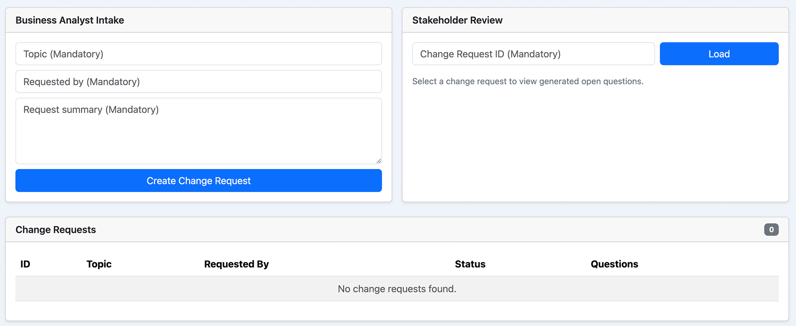
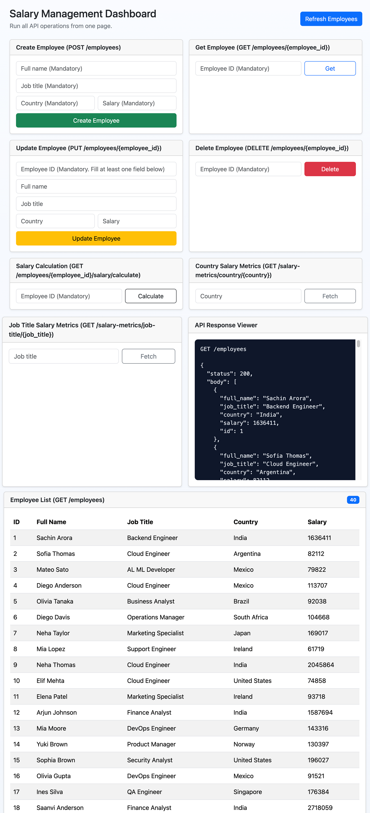

# Salary Management Kata

## 🎯 What This Is

This project is a FastAPI application with:
- a salary management API
- a Bootstrap dashboard UI
- a TDD-first workflow
- a documentation-driven change-request engine

In short: it manages employees, calculates deductions, shows salary metrics, and helps business analysts and stakeholders argue product logic in a civilized way before engineers start changing code.

## 🧰 Stack

- `Python 3.12+`
- `FastAPI`
- `SQLAlchemy`
- `SQLite`
- `Poetry`
- `Pytest`
- `Docker / Docker Compose`
- `Markdown-powered project memory in rulechain/`

## 🗂️ Project Layout

```text
salary-management-kata/
  salary_api/           # FastAPI app, services, UI files
  tests/                # automated tests
  docs/                 # GitHub Pages Swagger site assets
  rulechain/            # project memory and change-request workflow docs
  data/                 # SQLite database files
  logs/                 # runtime logs
  images/               # screenshots / diagrams
  legal/                # MIT and notice files
  .env                  # local environment values
  .env.example          # reference environment values
  Dockerfile            # container runtime
  docker-compose.yml    # local container orchestration
  Makefile              # install / run / test helpers
  pyproject.toml        # Poetry dependency declaration
  poetry.lock           # pinned dependencies
```

## 🚀 Quick Start

```bash
cd /Users/homesachin/Desktop/zoneone/practice/salary-management-kata
make install
make run
```

Open these:
- `http://127.0.0.1:8000/` : dashboard UI
- `http://127.0.0.1:8000/docs` : Swagger


Run tests:

```bash
make test
```

## 🐳 Docker Hub

Published image:
- [schnarordocker/salary-management-kata](https://hub.docker.com/r/schnarordocker/salary-management-kata)

Overview:
- Container image for the Salary Management Kata FastAPI app with the dashboard UI, employee CRUD APIs, salary metrics, and the rulechain-based change-request workflow.

Tags:
- `latest` : current default image used by `docker-compose.yml`
- future version tags can follow release numbers such as `v1.0.0`

Run it directly:

```bash
docker pull schnarordocker/salary-management-kata:latest
docker run --rm -p 8000:8000 schnarordocker/salary-management-kata:latest
```

## 🎬 Preview Video

Left-aligned on purpose, because the dashboard already has enough drama without the README doing center-stage choreography.

<a href="https://www.youtube.com/watch?v=dQw4w9WgXcQ">
  
</a>

## 📚 Public Swagger Docs With GitHub Pages

This repo can now publish static API docs for everyone, without asking reviewers to run the app locally first.

### What Was Added
- [`scripts/export_openapi.py`](/Users/homesachin/Desktop/zoneone/practice/salary-management-kata/scripts/export_openapi.py)
  - exports the FastAPI OpenAPI schema directly from the app
- [`.github/workflows/publish-api-docs.yml`](/Users/homesachin/Desktop/zoneone/practice/salary-management-kata/.github/workflows/publish-api-docs.yml)
  - builds the docs on GitHub Actions and publishes them to GitHub Pages

### Local Generation

```bash
poetry run python scripts/export_openapi.py
```

Generated files:
- `docs/openapi.json`
- `docs/index.html`

### How Public Hosting Works
1. Push your repo to GitHub.
2. In GitHub, enable **Pages** and choose **GitHub Actions** as the source.
3. On every push to `main`, GitHub Actions:
   - installs dependencies
   - generates the OpenAPI spec from the real FastAPI app
   - publishes `docs/` as a static site
4. Your public docs URL will be:
   - `https://<your-github-username>.github.io/<your-repo-name>/`

This gives you:
- public Swagger UI
- the raw OpenAPI JSON for tooling, imports, and future client generation

## ⚙️ Environment Variables

Use [`.env.example`](/Users/homesachin/Desktop/zoneone/practice/salary-management-kata/.env.example) as the template.

### Core App
- `APP_NAME` : app title
- `APP_HOST` : host binding
- `APP_PORT` : port binding
- `DATABASE_URL` : local DB connection string
- `LOG_LEVEL` : logging level
- `LOG_FILE` : runtime log file
- `DOCS_ROOT` : where markdown workflow files live

### Future LLM Provider Options

These are added now so production can later choose one provider without rethinking the env structure.

- `LLM_ANALYSIS_ENABLED`
- `LLM_PROVIDER`

OpenAI:
- `OPENAI_API_KEY`
- `OPENAI_MODEL`

Anthropic / Claude:
- `ANTHROPIC_API_KEY`
- `ANTHROPIC_MODEL`

Google / Gemini:
- `GOOGLE_API_KEY`
- `GOOGLE_MODEL`

Current reality check:
- the change-request analysis engine is still deterministic and local
- these env vars are placeholders for future provider integration
- no external LLM call is required for the app to run today

## 🌐 Product Surfaces

### 1. Employee Management
- create employees
- list employees
- get employee details
- update employee fields
- delete employees

### 2. Salary Logic
- calculate deductions and net salary by employee
- compute salary metrics by country
- compute average salary by job title

### 3. Change Request Workflow
- business analyst submits a change request
- the system generates open questions
- stakeholder answers the questions
- answers are stored in SQLite
- markdown files in `rulechain/` are synchronized from those records

That means the app is part payroll demo, part requirements traffic cop, and part historian with very strong feelings about ambiguity.

## 🔌 API Endpoints

### Employee CRUD
- `POST /employees`
  - creates a new employee
  - required fields: `full_name`, `job_title`, `country`, `salary`

- `GET /employees`
  - returns all employees

- `GET /employees/{employee_id}`
  - returns a single employee
  - `404` if the employee does not exist

- `PUT /employees/{employee_id}`
  - updates an employee
  - path `employee_id` is mandatory
  - body fields are optional
  - omitted fields remain unchanged
  - empty payload currently leaves the record unchanged

- `DELETE /employees/{employee_id}`
  - deletes an employee
  - returns `204` on success

### Salary Endpoints
- `GET /employees/{employee_id}/salary/calculate`
  - computes gross, deduction, and net salary
  - India: `10%`
  - United States: `12%`
  - all others: `0%`

- `GET /salary-metrics/country/{country}`
  - returns `min_salary`, `max_salary`, and `avg_salary`

- `GET /salary-metrics/job-title/{job_title}`
  - returns average salary for the given title

### Change Request Endpoints
- `POST /change-requests`
  - business analyst creates a new request
  - required business fields: `request_date`, `topic`, `request_summary`
  - request is stored in SQLite
  - context-aware open questions are generated immediately by the local analyzer
  - markdown change-request file is created automatically

- `GET /change-requests`
  - returns all stored change requests
  - useful for reloading state later
  - powers the dashboard table with `id`, `date`, `topic`, `status`, and question count

- `GET /change-requests/{id}`
  - returns one change request with its open questions and current status

- `GET /change-requests/{id}/questions`
  - returns only the open-question records for that request

- `POST /open-questions/{id}/answer`
  - stakeholder answers a generated question
  - answer is stored in SQLite
  - question status becomes `answered`
  - answer history is preserved
  - answered questions cannot be edited again in the current workflow
  - related markdown docs are updated automatically

- `POST /change-requests/{id}/preview`
  - generates a preview / plan only after all questions are answered
  - returns files to change, tests to update, docs to update, warnings, and a proposed diff preview

- `GET /change-requests/{id}/preview`
  - fetches the saved preview / plan for a request

- `POST /change-requests/{id}/reject`
  - marks the request as rejected

- `POST /change-requests/{id}/approve`
  - reserved for final approval after preview
  - approval is allowed only after preview exists
  - current behavior is intentionally guarded:
    - if provider-backed implementation is not configured, it blocks cleanly
    - if configured, the endpoint is still a controlled placeholder and does not yet auto-edit the repo

### UI and Static Endpoints
- `GET /`
  - serves the Bootstrap dashboard UI

- `GET /ui/app.js`
  - serves dashboard JavaScript

- `GET /ui/styles.css`
  - serves dashboard CSS

## 🖥️ Dashboard Flow

At `http://127.0.0.1:8000/` the UI now has:

- employee forms for create / get / update / delete
- salary calculators and metrics forms
- a live API response viewer
- a business analyst intake form
- a stakeholder review area
- a change-request table showing persisted records
- clickable topic text that opens a request-summary modal
- clickable question counts that open the generated-question modal
- table-row actions for preview and rejection
- a preview modal with a final `Approve And Implement` button

### Business Analyst Path
1. Fill the change-request form.
2. Provide only:
   - date
   - topic
   - request summary
3. Submit the business input.
4. The app stores the request in SQLite.
5. The app runs the local analyzer and generates context-aware open questions.
6. The app writes the request into `rulechain/CHANGE_REQUESTS/`.

### Stakeholder Path
1. Open the dashboard table.
2. Click the `Topic` text to open a centered modal with the full request summary.
3. Click the `Questions` count to open a centered modal with generated questions for that row.
4. Review:
   - question text
   - why this matters
   - blocked areas
   - status
   - current answer
5. Enter stakeholder name and answer.
6. Save the answer.
7. Come back later and see the stored answers and updated status from SQLite.

### Preview and Approval Path
1. Once all open questions are answered, the row becomes `answered`.
2. The `Preview` button becomes the next stop.
3. Preview shows:
   - files to change
   - tests to add or update
   - docs to update
   - conflict warnings
   - a proposed diff preview
4. From that preview modal, the reviewer can click `Approve And Implement`.
5. Today, that final step is intentionally guarded and does not yet auto-modify repository files.

No markdown editing is required from a non-technical user. The app does the syncing. The stakeholders get the decision process; the repo gets the audit trail; everyone gets fewer chaotic Slack interpretations of the same sentence.

## 🧪 TDD: Red → Green → Refactor

This project is intentionally built with TDD, which means behavior is proven before it is prettied up.

### 🔴 Red
In the red stage:
- write a test for the new behavior first
- run the suite
- confirm it fails for the right reason

Example:
- if we decide empty update payload should fail, we first add a test that expects `400`
- before any code changes, the current implementation would fail that test
- that failure is good because it proves the test is meaningful

### 🟢 Green
In the green stage:
- implement the minimum code needed to satisfy the failing test
- do not over-engineer
- run tests again
- confirm the new behavior passes

Example:
- add validation to reject empty update payloads
- rerun the suite
- confirm the new test and the old regression tests all pass

### 🔵 Refactor
In the refactor stage:
- clean up duplication
- move logic into helpers or services if needed
- improve naming and structure
- rerun the suite again

The important rule:
- refactor can change structure
- refactor must not change behavior

### What The Tests Actually Check

The current test suite verifies:
- create employee success
- invalid salary rejection
- get employee by ID
- list employees
- full update
- partial update
- omitted-field preservation
- empty update payload current behavior
- delete employee
- missing employee `404`
- India tax rule
- US tax rule
- no-deduction countries
- salary metrics by country
- salary metrics by job title
- change request creation
- context-aware open question generation
- stakeholder answer persistence
- prevention of re-answering an already answered question
- preview generation rules
- reject workflow
- markdown sync for change requests
- guarded approval behavior

That means the suite checks both:
- business behavior
- workflow behavior

So yes, the tests are checking logic, not just code that happens to exist.

## 🧠 Rulechain Folder: What Each File Does

See [rulechain/README.md](/Users/homesachin/Desktop/zoneone/practice/salary-management-kata/rulechain/README.md) for the short version. Here is the practical version:

- [IMPLEMENTATION_PROTOCOL.md](/Users/homesachin/Desktop/zoneone/practice/salary-management-kata/rulechain/IMPLEMENTATION_PROTOCOL.md)
  - the execution contract
  - says the system must read docs first, ask questions on conflicts, then do TDD

- [DOMAIN_RULES.md](/Users/homesachin/Desktop/zoneone/practice/salary-management-kata/rulechain/DOMAIN_RULES.md)
  - the business rule source of truth
  - create/update rules, salary rules, and known logic notes live here

- [DECISION_LOG.md](/Users/homesachin/Desktop/zoneone/practice/salary-management-kata/rulechain/DECISION_LOG.md)
  - records accepted product decisions
  - helpful when future requests try to contradict older choices

- [TEST_MATRIX.md](/Users/homesachin/Desktop/zoneone/practice/salary-management-kata/rulechain/TEST_MATRIX.md)
  - maps business rules to tests
  - helps answer: “Did we really test this?”

- [OPEN_QUESTIONS.md](/Users/homesachin/Desktop/zoneone/practice/salary-management-kata/rulechain/OPEN_QUESTIONS.md)
  - central summary of unresolved questions
  - gets synchronized from change-request data

- [CHANGE_IMPACT.md](/Users/homesachin/Desktop/zoneone/practice/salary-management-kata/rulechain/CHANGE_IMPACT.md)
  - pre-change checklist for possible regressions and conflicts

- `CHANGE_REQUESTS/*.md`
  - one markdown record per change request
  - includes business input and implementation analysis
  - now partly generated/synced by the app itself

## 🔄 Change Request End-to-End Story

Here is the full loop:

1. Business analyst submits:
   - request date
   - topic
   - request summary

2. The app stores that request in SQLite.

3. The app generates context-aware open questions using the local expert analyzer.

4. The app stores those questions in SQLite.

5. The app writes a markdown file in `rulechain/CHANGE_REQUESTS/`.

6. The dashboard table shows the request with:
   - ID
   - date
   - topic
   - status
   - number of questions

7. Clicking the topic opens the request-summary modal.

8. Clicking the question count opens the questions modal.

9. Stakeholder answers the questions inside that modal.

10. The answers are stored in SQLite, so they remain visible later.

11. The markdown file and `rulechain/OPEN_QUESTIONS.md` are synchronized from the latest stored records.

12. When all questions are answered, the request becomes `answered`.

13. The reviewer can generate a preview / plan.

14. The preview explains what would change before any code or docs are touched.

15. A final approval button exists in the preview modal, but the repository auto-edit/apply step is still intentionally not active.

That means:
- SQLite is the live source of record
- markdown is the readable audit trail
- tests protect the workflow

### Status Rules
- `awaiting_answers`
  - the change request exists and at least one generated question is still unanswered
- `answered`
  - all generated questions have been answered by stakeholders
- `preview_ready`
  - the preview / plan has been generated and is ready for final approval
- `rejected`
  - the request was explicitly rejected from the table action

The status changes automatically when answers are saved through `POST /open-questions/{id}/answer`.

## 📦 Docker

### Pull From Docker Hub

If you just want to run the app without cloning the repo first:

```bash
docker pull schnarordocker/salary-management-kata:latest
docker run --rm -p 8000:8000 schnarordocker/salary-management-kata:latest
```

Open:
- `http://127.0.0.1:8000/` : dashboard UI
- `http://127.0.0.1:8000/docs` : Swagger

### Run With Docker Compose

Build and run:

```bash
docker compose up --build
```

Stop:

```bash
docker compose down
```

## 📁 Data, Logs, Images, Legal

- `data/` : SQLite DB files
- `logs/` : application logs
- `images/` : screenshots and diagrams
- `legal/` : MIT and notice files

## 🧾 TDD Commit Trail

- `fa724c7` test(crud): add failing employee CRUD tests
- `f7e9782` feat(crud): implement employee CRUD
- `196e1c7` refactor(test): isolate DB per test and clean cache artifacts
- `c13f478` test(salary): add failing salary calculation tests
- `b365741` feat(salary): implement salary calculation
- `c18ac10` test(metrics): add failing salary metrics tests
- `ae9220f` feat(metrics): implement salary metrics
- `2b99426` refactor(docs): extract helpers and add docs

## 🤖 AI Usage Transparency

AI was used intentionally for:
- scaffolding
- test-first sequencing
- API and UI implementation
- documentation structure
- ops files and workflow docs

The guardrails were:
- tests first
- explicit business rules
- markdown-based project memory
- human review of logic decisions

So yes, the AI helped build the machine, but the tests are the suspicious accountant making sure it does not start freelancing new business rules at 2 AM.

## 🖼️ Screenshots

Original-size, left-aligned images live in [`images/`](/Users/homesachin/Desktop/zoneone/practice/salary-management-kata/images).




